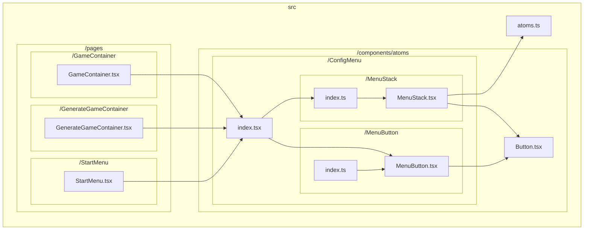

# TypeScript graph

A CLI to visualize the dependencies between files in the TypeScript codebase.

For example, the following command in the base directory of https://github.com/ysk8hori/numberplace will produce the following results:

```bash
tsg --include src/components/atoms/ConfigMenu --exclude test stories node_modules
```



## Installation

```bash
npm install --save-dev @ysk8hori/typescript-graph
```

or global install.

## Options

Run the `tsg -h` for help

```Options:
  -V, --version        output the version number
  --md <char>          Specify the name of the markdown file to be output. Default is typescript-graph.md.
  --mermaid-link       Generates a link on node to open that file in VSCode.
  -d, --dir <char>     Specify the TypeScript code base to be analyzed. if tsconfig.json is not found, specify the
                       directory where tsconfig.json is located.
  --include <char...>  Specify paths and file names to be included in the graph
  --exclude <char...>  Specify the paths and file names to be excluded from the graph
  --ab <char...>       Specify the path to abstract
  --LR                 Specify Flowchart orientation Left-to-Right
  --TB                 Specify Flowchart orientation Top-to-Bottom
  --neo4j              output to neo4j on localhost:7687
  --clear-db           clear neo4j database before output
  -h, --help           display help for command
```
