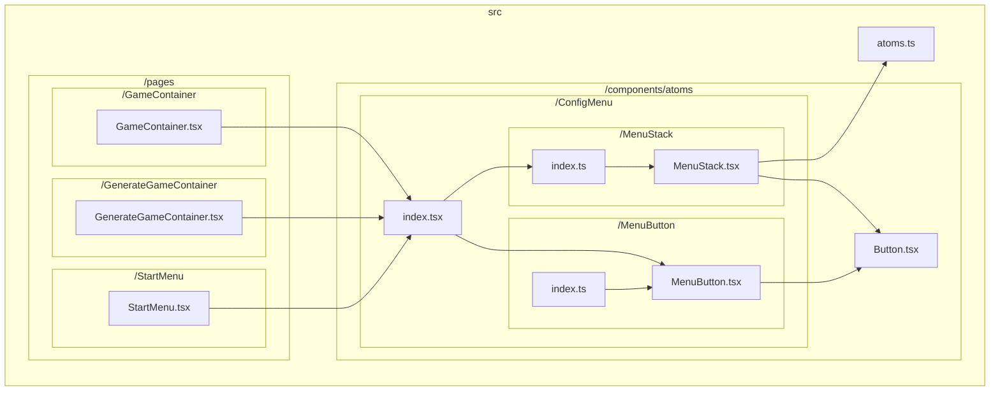
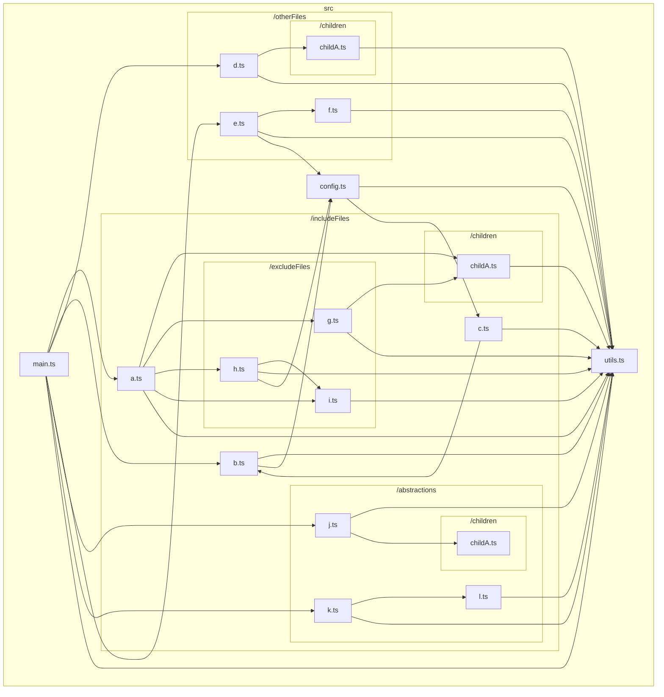
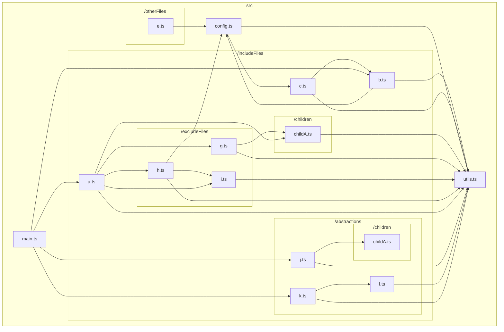
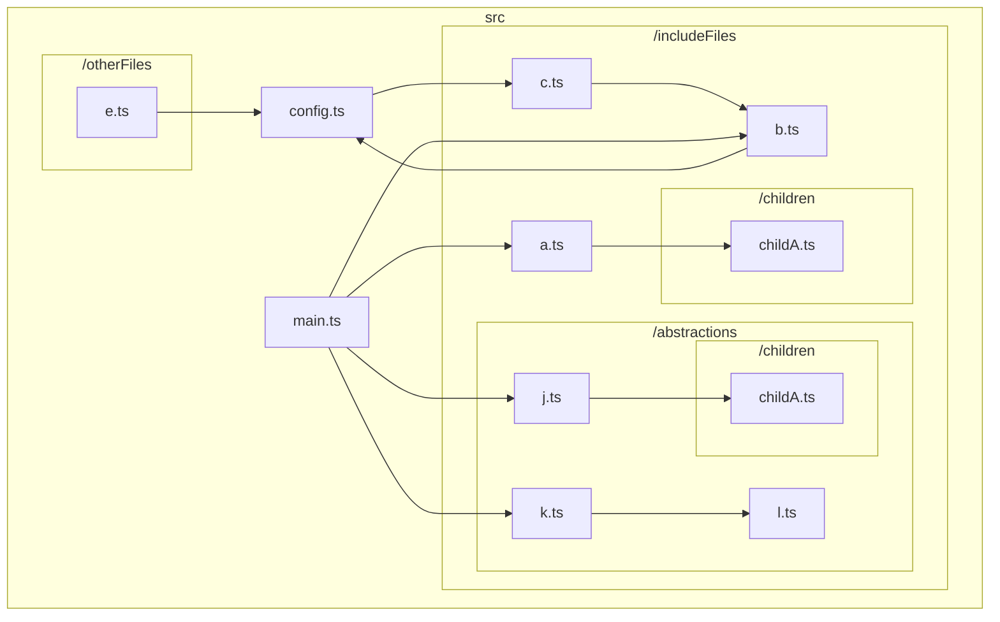
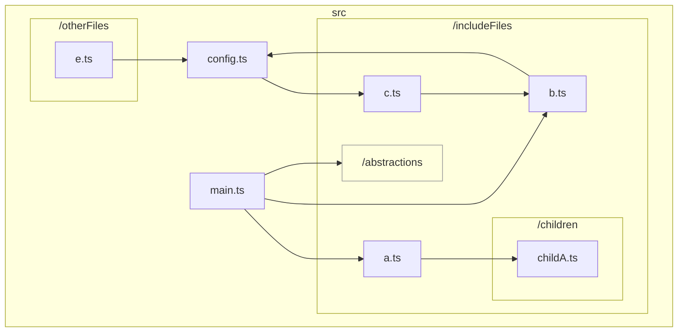
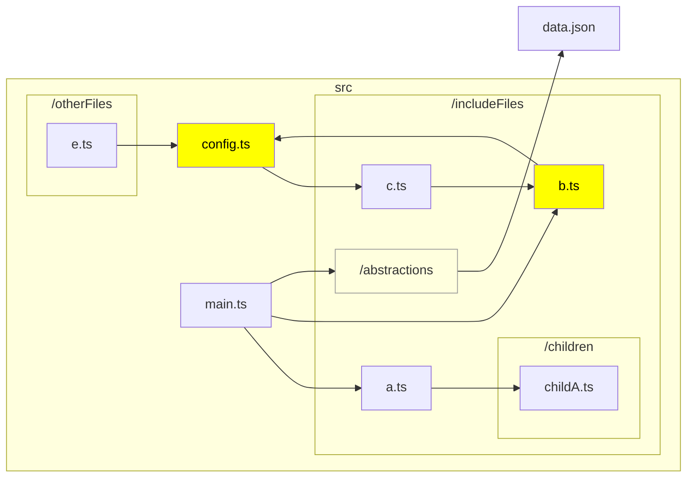

# TypeScript graph

<p align="center">
  <a href="/docs/README_en.md">English</a> •
  <a href="/docs/README_ja.md">日本語 (Japanese)</a> 
</p>

A CLI to visualize the dependencies between files in the TypeScript codebase.

For example, the following command in the base directory of https://github.com/ysk8hori/numberplace will produce the following results:

```bash
tsg --include src/components/atoms/ConfigMenu --exclude test stories node_modules
```



## Installation

```bash
npm install --global @ysk8hori/typescript-graph
```

## Options

Run the `tsg -h` for help

```Options:
  -V, --version            output the version number
  --md <char>              Specify the name of the markdown file to be output. Default is typescript-graph.md.
  --mermaid-link           Generates a link on node to open that file in VSCode.
  -d, --dir <char>         Specify the TypeScript code base to be analyzed. if tsconfig.json is not found, specify the directory where tsconfig.json is located.
  --include <char...>      Specify paths and file names to be included in the graph
  --exclude <char...>      Specify the paths and file names to be excluded from the graph
  --abstraction <char...>  Specify the path to abstract
  --highlight <char...>    Specify the path and file name to highlight
  --LR                     Specify Flowchart orientation Left-to-Right
  --TB                     Specify Flowchart orientation Top-to-Bottom
  --config-file            Specify the relative path to the config file (from cwd or specified by -d, --dir). Default is .tsgrc.json.
  -h, --help               display help for command
```

## usage

Run `tsg` on the project you want to analyze.

```bash
tsg
```



👆 and outputs file dependencies.

It is cluttered and confusing.
Also, for large repositories, Mermaid may exceed the maximum amount of data that can be displayed.

In that case, you need to narrow down the directories to include in the graph.

### `--include`

Use the `--include` option to narrow down the directories and files to include in the graph.

```bash
tsg --include includeFiles config
```



The dependencies of the directory specified by `--include` will be output as shown in 👆.
However, files that depend on files under the directory specified by `--include` will remain visible.
If there are directories or files you are not interested in, use `--exclude` to exclude them.

#### Exclude Exception via Full Path Specification (Experimental)

There might be scenarios where you would want to ignore dependency relations for a certain folder using `exclude`, but within that folder, there may exist some files you wish to include in the graph. In such cases, you can use `--include` to specify the full path of a particular file, effectively removing it from the exclusion list. This ensures that the specified file is not left out despite the general exclusion of its parent folder.

### `--exclude`

Directories and files to be excluded from the graph are excluded with the `--exclude` option.

```bash
tsg --include includeFiles config --exclude excludeFiles utils
```



The directories specified with `--exclude` were excluded from the dependency graph.

Oops, `src/includeFiles/b.ts`, `src/includeFiles/c.ts` and `src/config.ts` were circular references. Report this immediately to your team for refactoring. However, `src/includeFiles/abstractions` has nothing to do with this issue, so we don't want to show them the details if possible. You can hide the details of `src/includeFiles/abstractions` with `--abstraction`.

### `--abstraction`

Sometimes you may not be interested in the files in a directory, but wish to keep the dependencies on that directory in the graph.
In such cases, use `--abstraction` to abstract the directory.

```bash
tsg --include includeFiles config --exclude excludeFiles utils --abstraction abstractions
```



This makes it easier to share problems within the team👍.

However, I would like to emphasize what I would like to see emphasized 🤔.

### `--highlight`

Use `--highlight` to highlight nodes that need attention.

```bash
tsg --include includeFiles config --exclude excludeFiles utils --abstraction abstractions --highlight config.ts b.ts --LR
```



It makes it easier to share problems within the team. 👍

## Other Options

### --mermaid-link

Add a link to the Mermaid node to open it in VSCode; Mermaid will output a click event as follows

```
    click src/createGraph.ts href "vscode://file//your/path/typescript-graph/src/createGraph.ts" _blank
```

However, this does not work. The click event definition is correct, and the URL is correct, but it does not work in VSCode's Mermaid Preview. This is a feature I implemented in hopes that it will work someday🤣.
