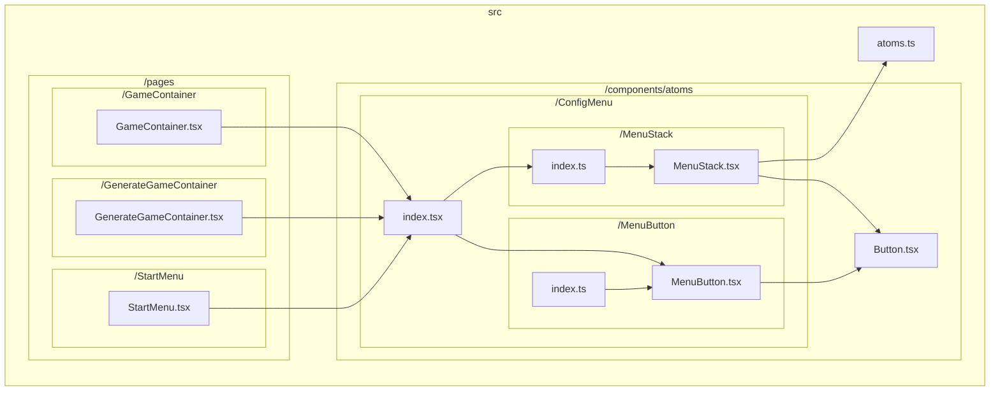
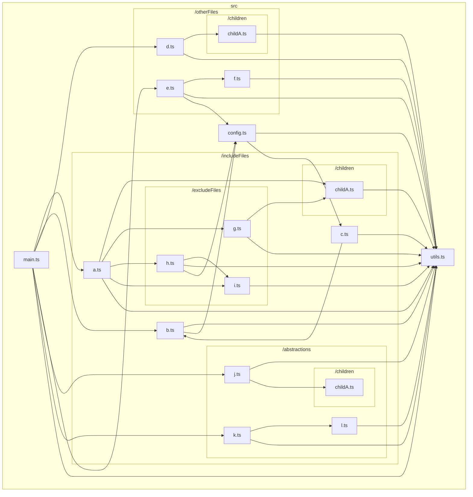
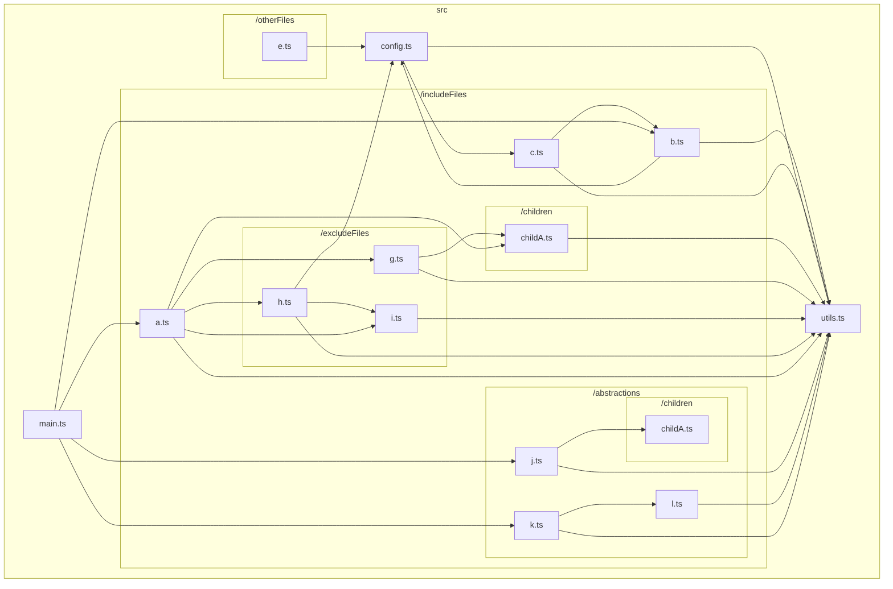
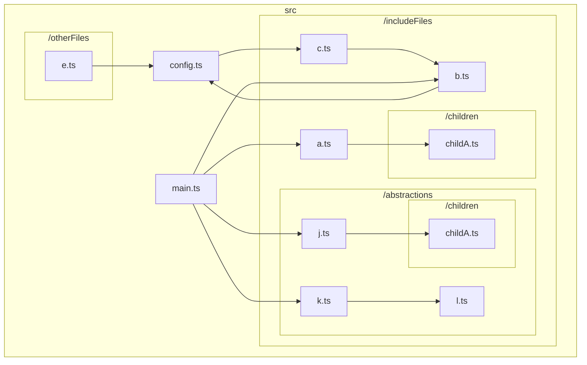
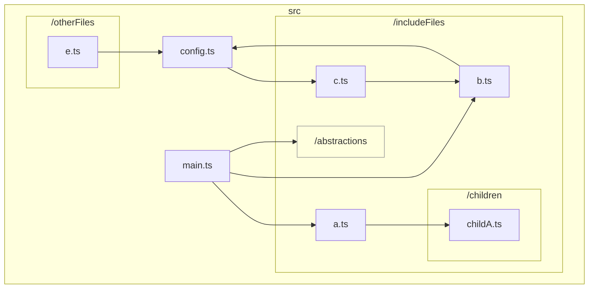
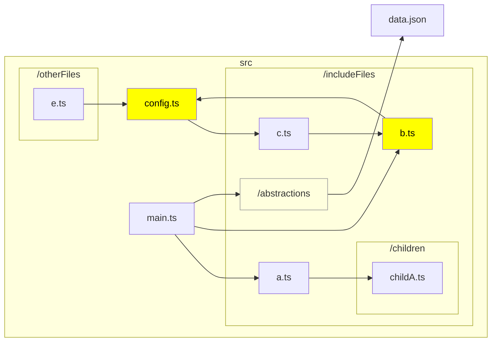

# TypeScript graph

<p align="center">
  <a href="/docs/README_en.md">English</a> •
  <a href="/docs/README_ja.md">日本語 (Japanese)</a> 
</p>

A CLI to visualize the dependencies between files in the TypeScript codebase.

For example, the following command in the base directory of https://github.com/ysk8hori/numberplace will produce the following results:

```bash
tsg src/components/atoms/ConfigMenu --exclude test stories node_modules
```



## Installation

```bash
npm install --global @ysk8hori/typescript-graph
```

## Arguments

| Argument        | Description                                                                                                                         |
| --------------- | ----------------------------------------------------------------------------------------------------------------------------------- |
| `include-files` | Specify file paths or parts of file paths to include in the graph (relative to the tsconfig directory, without `./`). (default: "") |

## Options

| Option                    | Description                                                                                                                                                                                                                                                                                                             |
| ------------------------- | ----------------------------------------------------------------------------------------------------------------------------------------------------------------------------------------------------------------------------------------------------------------------------------------------------------------------- |
| `-V, --version`           | Output the version number                                                                                                                                                                                                                                                                                               |
| `--md <char>`             | Specify the name of the markdown file to be output. The default is typescript-graph.md.                                                                                                                                                                                                                                 |
| `--mermaid-link`          | (experimental) Generates a link on a node to open the corresponding file in VSCode.                                                                                                                                                                                                                                     |
| `-d, --dir <char>`        | Specifies the root directory of the TypeScript project to analyze. It reads and uses the tsconfig.json file found in this directory.                                                                                                                                                                                    |
| `--tsconfig <char>`       | Specifies the path to the tsconfig file to use for analysis. If this option is provided, -d, --dir will be ignored.                                                                                                                                                                                                     |
| `--include <char...>`     | Specify file paths or parts of file paths to include in the graph (relative to the tsconfig directory, without `./`).                                                                                                                                                                                                   |
| `--exclude <char...>`     | Specify file paths or parts of file paths to exclude from the graph (relative to the tsconfig directory, without `./`).                                                                                                                                                                                                 |
| `--abstraction <char...>` | Specify the paths of directories to be abstracted. Abstracted directories are treated as a single node.                                                                                                                                                                                                                 |
| `--highlight <char...>`   | Specify the path and file names to be highlighted.                                                                                                                                                                                                                                                                      |
| `--LR`                    | Set the flowchart orientation to Left-to-Right.                                                                                                                                                                                                                                                                         |
| `--TB`                    | Set the flowchart orientation to Top-to-Bottom.                                                                                                                                                                                                                                                                         |
| `--measure-instability`   | Enable the beta feature to measure the instability of modules.                                                                                                                                                                                                                                                          |
| `--config-file`           | Specify the relative path to the config file (from the current directory or as specified by -d, --dir). The default is .tsgrc.json.                                                                                                                                                                                     |
| `--vue` (experimental)    | `.vue` files are also included in the analysis. A temporary working directory is created using Node.js's `fs.mkdtempSync`, where all files targeted by `tsc` as well as `.vue` files are copied for processing. `.vue` files are renamed to `.vue.ts` unless a file with the same name already exists in the directory. |
| `-h, --help`              | Display help for the command.                                                                                                                                                                                                                                                                                           |

## usage

Run `tsg` on the project you want to analyze.

```bash
tsg
```



👆 and outputs file dependencies.

It is cluttered and confusing.
Also, for large repositories, Mermaid may exceed the maximum amount of data that can be displayed.

In that case, you need to narrow down the directories to include in the graph.

### Arguments or `--include`

To narrow down the directories or files included in the graph, specify the paths or parts of the paths using either the argument or the `--include` option.

```bash
tsg src/includeFiles config
```



As mentioned above, only the dependencies of the directories specified by the argument or the `--include` option will be output. However, the dependencies of the files under the specified directories will still be displayed. If there are directories or files you are not interested in, use the `--exclude` option to exclude them.

#### Exclude Exception via Full Path Specification (Experimental)

There might be scenarios where you would want to ignore dependency relations for a certain folder using `exclude`, but within that folder, there may exist some files you wish to include in the graph. In such cases, you can exclude a specific file from the exclusion list by specifying its full path in the argument or with the `--include` option.

### `--exclude`

Directories and files to be excluded from the graph are excluded with the `--exclude` option.

```bash
tsg includeFiles config --exclude excludeFiles utils
```



The directories specified with `--exclude` were excluded from the dependency graph.

Oops, `src/includeFiles/b.ts`, `src/includeFiles/c.ts` and `src/config.ts` were circular references. Report this immediately to your team for refactoring. However, `src/includeFiles/abstractions` has nothing to do with this issue, so we don't want to show them the details if possible. You can hide the details of `src/includeFiles/abstractions` with `--abstraction`.

### `--abstraction`

Sometimes you may not be interested in the files in a directory, but wish to keep the dependencies on that directory in the graph.
In such cases, use `--abstraction` to abstract the directory.

```bash
tsg includeFiles config --exclude excludeFiles utils --abstraction abstractions
```



This makes it easier to share problems within the team👍.

However, I would like to emphasize what I would like to see emphasized 🤔.

### `--highlight`

Use `--highlight` to highlight nodes that need attention.

```bash
tsg includeFiles config --exclude excludeFiles utils --abstraction abstractions --highlight config.ts b.ts --LR
```



It makes it easier to share problems within the team. 👍

## Other Options

### --mermaid-link

Add a link to the Mermaid node to open it in VSCode; Mermaid will output a click event as follows

```
    click src/createGraph.ts href "vscode://file//your/path/typescript-graph/src/createGraph.ts" _blank
```

However, this does not work. The click event definition is correct, and the URL is correct, but it does not work in VSCode's Mermaid Preview. This is a feature I implemented in hopes that it will work someday🤣.
