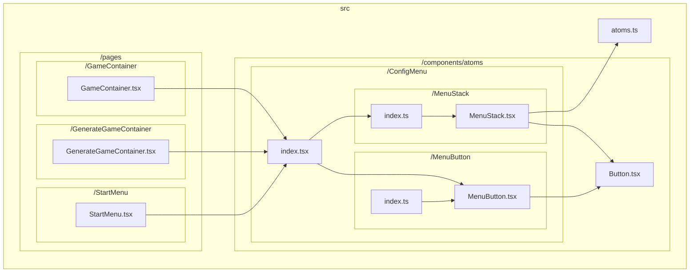
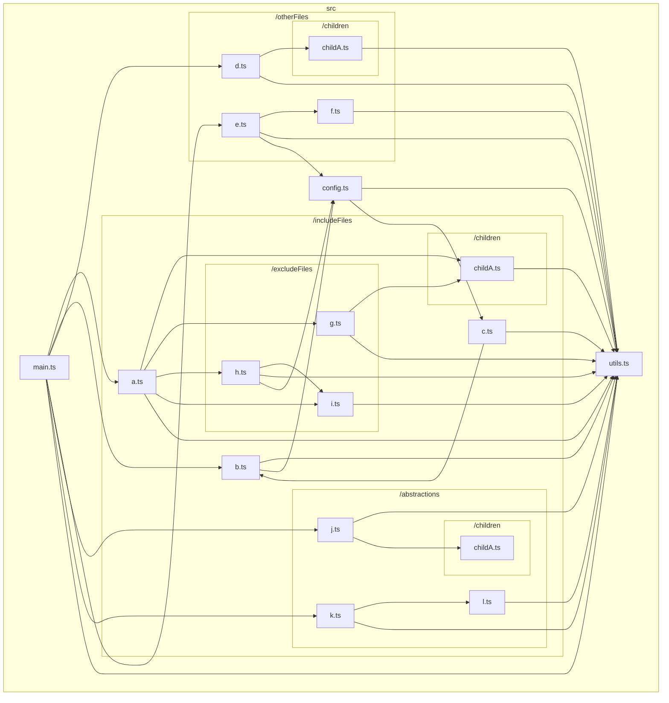
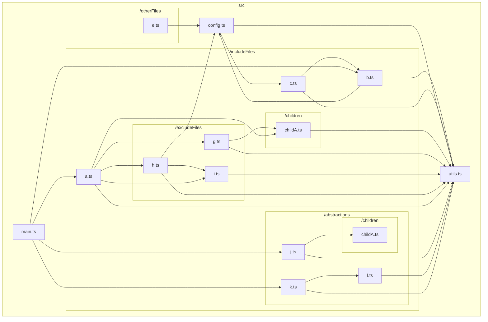
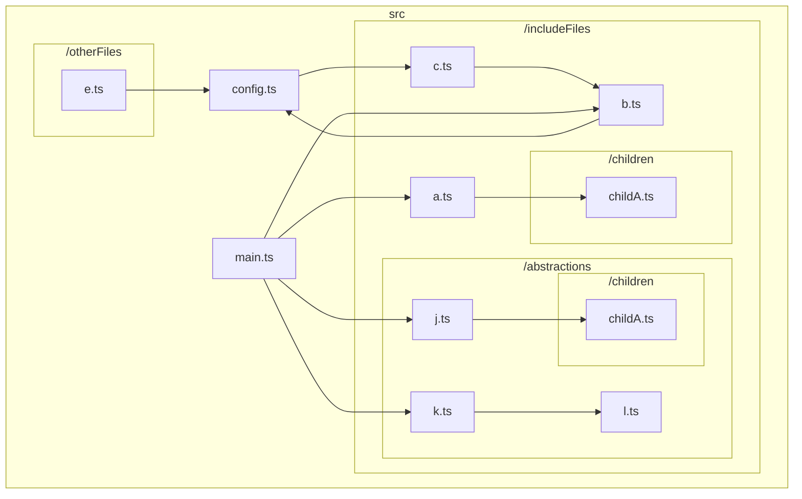
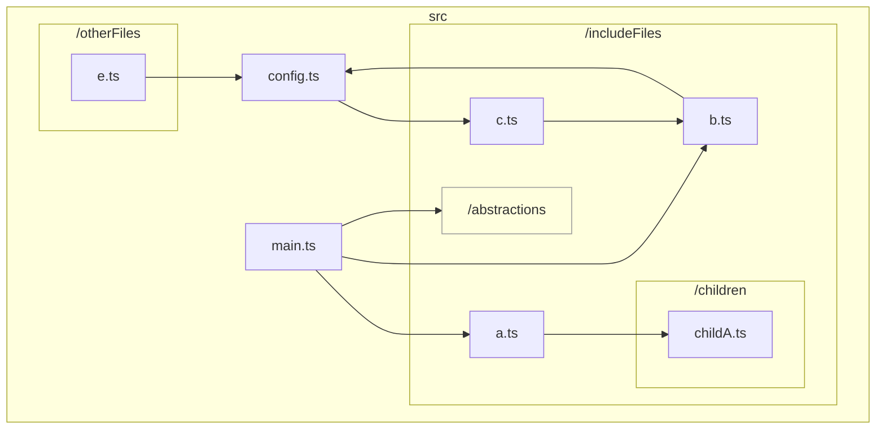
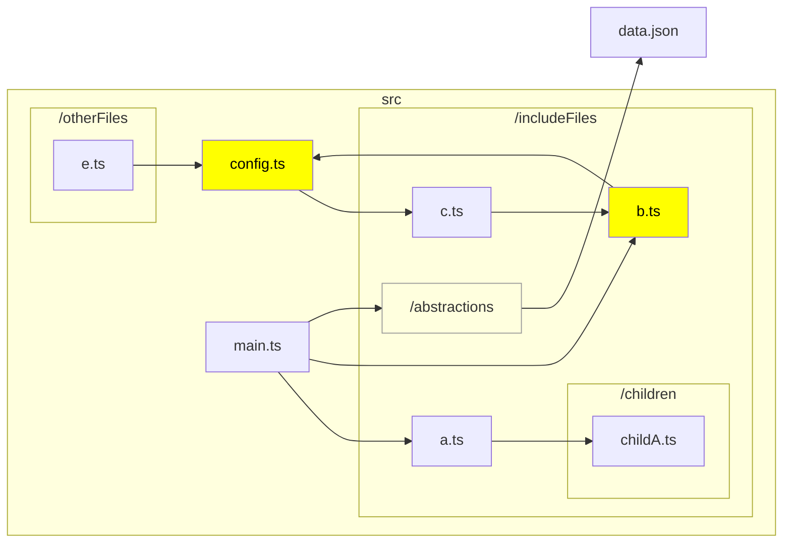
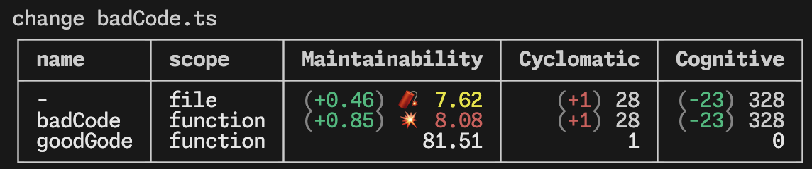

# TypeScript graph

<p align="center">
  <a href="/docs/README_en.md">English</a> •
  <a href="/docs/README_ja.md">日本語 (Japanese)</a> 
</p>

A CLI to visualize the dependencies between files in the TypeScript codebase.

For example, the following command in the base directory of https://github.com/ysk8hori/numberplace will produce the following results:

```bash
tsg src/components/atoms/ConfigMenu --exclude test stories node_modules
```



## Installation

```bash
npm install --global @ysk8hori/typescript-graph
```

## Arguments

| Argument        | Description                                                                                                                         |
| --------------- | ----------------------------------------------------------------------------------------------------------------------------------- |
| `include-files` | Specify file paths or parts of file paths to include in the graph (relative to the tsconfig directory, without `./`). (default: "") |

## Options

| Option                    | Description                                                                                                                                                                                                                                                                                                             |
| ------------------------- | ----------------------------------------------------------------------------------------------------------------------------------------------------------------------------------------------------------------------------------------------------------------------------------------------------------------------- |
| `-V, --version`           | Output the version number                                                                                                                                                                                                                                                                                               |
| `--md <char>`             | Specify the name of the markdown file to be output. The default is typescript-graph.md.                                                                                                                                                                                                                                 |
| `-d, --dir <char>`        | Specifies the root directory of the TypeScript project to analyze. It reads and uses the tsconfig.json file found in this directory.                                                                                                                                                                                    |
| `--tsconfig <char>`       | Specifies the path to the tsconfig file to use for analysis. If this option is provided, -d, --dir will be ignored.                                                                                                                                                                                                     |
| `--include <char...>`     | Specify file paths or parts of file paths to include in the graph (relative to the tsconfig directory, without `./`).                                                                                                                                                                                                   |
| `--exclude <char...>`     | Specify file paths or parts of file paths to exclude from the graph (relative to the tsconfig directory, without `./`).                                                                                                                                                                                                 |
| `--abstraction <char...>` | Specify the paths of directories to be abstracted. Abstracted directories are treated as a single node.                                                                                                                                                                                                                 |
| `--highlight <char...>`   | Specify the path and file names to be highlighted.                                                                                                                                                                                                                                                                      |
| `--LR`                    | Set the flowchart orientation to Left-to-Right.                                                                                                                                                                                                                                                                         |
| `--TB`                    | Set the flowchart orientation to Top-to-Bottom.                                                                                                                                                                                                                                                                         |
| `--measure-instability`   | Enable the beta feature to measure the instability of modules.                                                                                                                                                                                                                                                          |
| `--metrics`               | Enables a beta feature to measure code metrics such as Maintainability Index, Cyclomatic Complexity, and Cognitive Complexity. This can be used as an analytical tool to quantitatively evaluate code quality.                                                                                                          |
| `-w, --watch-metrics`     | Monitors file changes in real-time and displays metrics such as Maintainability Index, Cyclomatic Complexity, and Cognitive Complexity whenever changes occur. Ideal for continuous quality monitoring.                                                                                                                 |
| `--config-file`           | Specify the relative path to the config file (from the current directory or as specified by -d, --dir). The default is .tsgrc.json.                                                                                                                                                                                     |
| `--vue` (experimental)    | `.vue` files are also included in the analysis. A temporary working directory is created using Node.js's `fs.mkdtempSync`, where all files targeted by `tsc` as well as `.vue` files are copied for processing. `.vue` files are renamed to `.vue.ts` unless a file with the same name already exists in the directory. |
| `--json`                  | Output structured data in JSON format to stdout instead of generating a markdown file.                                                                                                                                                                                                                                   |
| `--mermaid`               | Output Mermaid diagram syntax to stdout instead of generating a markdown file.                                                                                                                                                                                                                                           |
| `-h, --help`              | Display help for the command.                                                                                                                                                                                                                                                                                           |

## usage

Run `tsg` on the project you want to analyze.

```bash
tsg
```



👆 and outputs file dependencies.

It is cluttered and confusing.
Also, for large repositories, Mermaid may exceed the maximum amount of data that can be displayed.

In that case, you need to narrow down the directories to include in the graph.

### Arguments or `--include`

To narrow down the directories or files included in the graph, specify the paths or parts of the paths using either the argument or the `--include` option.

```bash
tsg src/includeFiles config
```



As mentioned above, only the dependencies of the directories specified by the argument or the `--include` option will be output. However, the dependencies of the files under the specified directories will still be displayed. If there are directories or files you are not interested in, use the `--exclude` option to exclude them.

#### Exclude Exception via Full Path Specification (Experimental)

There might be scenarios where you would want to ignore dependency relations for a certain folder using `exclude`, but within that folder, there may exist some files you wish to include in the graph. In such cases, you can exclude a specific file from the exclusion list by specifying its full path in the argument or with the `--include` option.

### `--exclude`

Directories and files to be excluded from the graph are excluded with the `--exclude` option.

```bash
tsg includeFiles config --exclude excludeFiles utils
```



The directories specified with `--exclude` were excluded from the dependency graph.

Oops, `src/includeFiles/b.ts`, `src/includeFiles/c.ts` and `src/config.ts` were circular references. Report this immediately to your team for refactoring. However, `src/includeFiles/abstractions` has nothing to do with this issue, so we don't want to show them the details if possible. You can hide the details of `src/includeFiles/abstractions` with `--abstraction`.

### `--abstraction`

Sometimes you may not be interested in the files in a directory, but wish to keep the dependencies on that directory in the graph.
In such cases, use `--abstraction` to abstract the directory.

```bash
tsg includeFiles config --exclude excludeFiles utils --abstraction abstractions
```



This makes it easier to share problems within the team👍.

However, I would like to emphasize what I would like to see emphasized 🤔.

### `--highlight`

Use `--highlight` to highlight nodes that need attention.

```bash
tsg includeFiles config --exclude excludeFiles utils --abstraction abstractions --highlight config.ts b.ts --LR
```



It makes it easier to share problems within the team. 👍

## Code Metrics Measurement

This is a beta feature for measuring code metrics such as the Maintainability Index, Cyclomatic Complexity, and Cognitive Complexity. While these metrics are widely recognized, their reliability in TypeScript-specific contexts is not guaranteed. Nonetheless, they can serve as helpful indicators for evaluating code quality.

For example, navigate to `typescript-graph/dummy_project_for_metrics` and execute the following command:

```bash
tsg --metrics
```

In addition to the usual content of `typescript-graph.md`, metrics like the following will be output:

---

<table>
<thead><tr><th scope="col">file</th><th scope="col">scope</th><th scope="col">name</th><th scope="col">Maintainability Index</th><th scope="col">Cyclomatic Complexity</th><th scope="col">Cognitive Complexity</th><th scope="col">lines</th><th scope="col">semantic syntax volume</th><th scope="col">total operands</th><th scope="col">unique operands</th><th scope="col">total semantic syntax</th><th scope="col">unique semantic syntax</th></tr></thead>
<tbody>
<tr><th scope="row">badCode.ts</th><th scope="row">file</th><th scope="row">-</th><td> 28.54</td><td> 27</td><td> 351</td><td> 111</td><td> 1807.98</td><td> 107</td><td> 55</td><td> 190</td><td> 13</td></tr>
<tr><th scope="row">badCode.ts</th><th scope="row">function</th><th scope="row">badCode</th><td>💥 7.23</td><td> 27</td><td> 351</td><td> 110</td><td> 1814.06</td><td> 107</td><td> 55</td><td> 191</td><td> 13</td></tr>
<tr><th scope="row">goodCode.ts</th><th scope="row">file</th><th scope="row">-</th><td> 82.21</td><td> 2</td><td> 1</td><td> 4</td><td> 77.66</td><td> 6</td><td> 4</td><td> 13</td><td> 13</td></tr>
<tr><th scope="row">goodCode.ts</th><th scope="row">function</th><th scope="row">goodCode</th><td> 76</td><td> 2</td><td> 1</td><td> 3</td><td> 81.75</td><td> 6</td><td> 4</td><td> 14</td><td> 13</td></tr>
</tbody></table>
<details>
<summary>CSV</summary>

```csv
file,scope,name,Maintainability Index,Cyclomatic Complexity,Cognitive Complexity,lines,semantic syntax volume,total operands,unique operands,total semantic syntax,unique semantic syntax
badCode.ts,file,-,28.540438644839494,27,351,111,1807.9764638513507,107,55,190,13
badCode.ts,function,badCode,7.2309524830767815,27,351,110,1814.063926692601,107,55,191,13
goodCode.ts,file,-,82.20502409726409,2,1,4,77.66179398375644,6,4,13,13
goodCode.ts,function,goodCode,75.99910291534641,2,1,3,81.74925682500678,6,4,14,13
```

</details>

<details>
<summary>TSV</summary>

```tsv
file	scope	name	Maintainability Index	Cyclomatic Complexity	Cognitive Complexity	lines	semantic syntax volume	total operands	unique operands	total semantic syntax	unique semantic syntax
badCode.ts	file	-	28.540438644839494	27	351	111	1807.9764638513507	107	55	190	13
badCode.ts	function	badCode	7.2309524830767815	27	351	110	1814.063926692601	107	55	191	13
goodCode.ts	file	-	82.20502409726409	2	1	4	77.66179398375644	6	4	13	13
goodCode.ts	function	goodCode	75.99910291534641	2	1	3	81.74925682500678	6	4	14	13
```

</details>

---

### Maintainability Index

This metric calculates an index value ranging from 0 to 100, representing the relative ease of maintaining the code. Higher values indicate better maintainability. Two thresholds are defined, and an icon is displayed if the index falls below them.
Since this is a beta feature, the formulas and thresholds may change.

| threshold | state    | icon |
| --------- | -------- | ---- |
| 20        | alert    | 🧨   |
| 10        | critical | 💥   |

Future updates may introduce customizations for formulas and thresholds.

### Cyclomatic Complexity

Cyclomatic Complexity in TypeScript Graph includes Conditional Types. For additional information, a web search will provide more precise details than this document.

### Cognitive Complexity

In simple terms, Cognitive Complexity is similar to Cyclomatic Complexity in that it scores based on control flow branches. However, it imposes penalties for nested control structures.

This implementation is based on the whitepaper “[A new way of measuring understandability](https://www.sonarsource.com/docs/CognitiveComplexity.pdf)” by G. Ann Campbell from [SonarSource](https://www.sonarsource.com). Note that this project is not affiliated with SonarSource.

Currently, the implementation does not fully account for TypeScript's type system. We acknowledge the need for improvements and may address this in future updates.

#### Differences from SonarSource's Cognitive Complexity

The handling of functions assigned to objects as substitutes for classes differs. SonarSource only increments nesting levels when the structure is non-declarative. In contrast, TypeScript Graph increments nesting levels without considering whether the structure is declarative.

### Semantic Syntax Volume

The Maintainability Index calculation typically uses the Halstead Volume metric, which is derived from the total and unique counts of operators and operands in the source code.

In TypeScript Graph, the number of non-operand nodes in the AST (after excluding nodes deemed irrelevant for counting) is used as a substitute, as counting operators directly from the AST can be cumbersome.

The calculation formula is as follows:

```typescript
function volume(): number {
  const N = totalSemanticSyntax.count + totalOperands.count;
  const n = uniqueSemanticSyntax.count + uniqueOperands.count;
  return N * Math.log2(n);
}
```

### Monitoring Code Metrics

You can monitor file changes in real time and display metrics such as the Maintainability Index, Cyclomatic Complexity, and Cognitive Complexity whenever changes occur using the following command:

```bash
tsg --watch-metrics
```



The values in `()` represent the difference from when monitoring started. Improvements are displayed in green, while regressions are shown in red. Whether an increase or decrease is better depends on the metric. The following table outlines the preferred directions for each metric:

| Metrics Name          | Better Direction |
| --------------------- | ---------------- |
| Maintainability Index | Higher           |
| Cyclomatic Complexity | Lower            |
| Cognitive Complexity  | Lower            |
