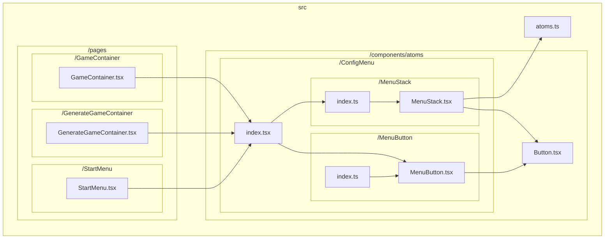
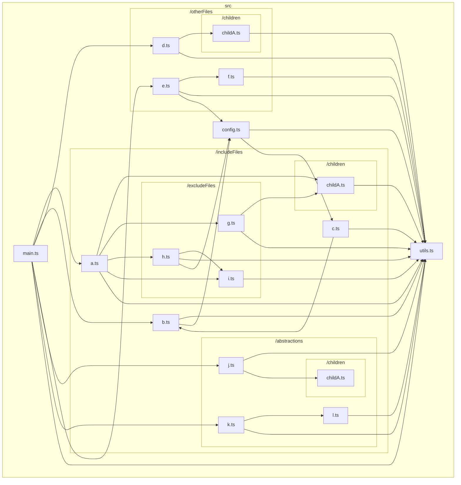
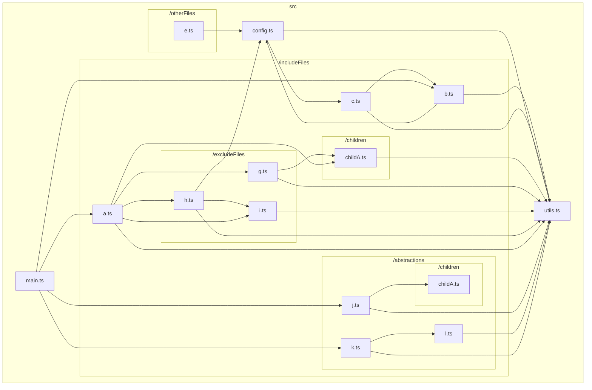
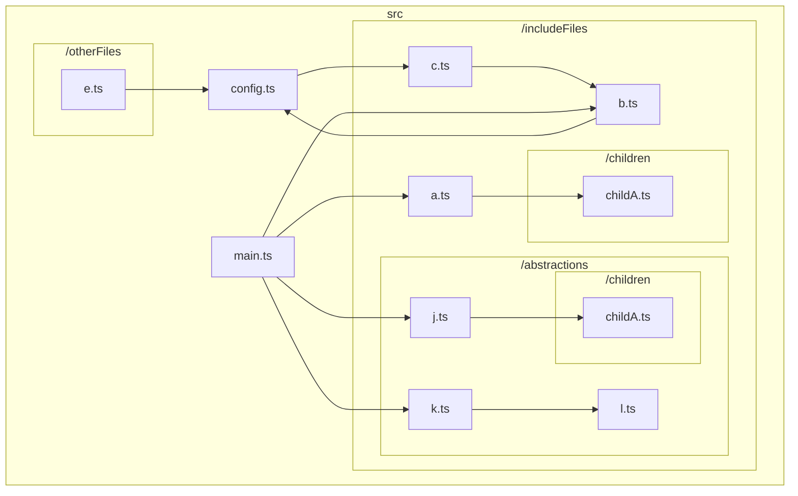
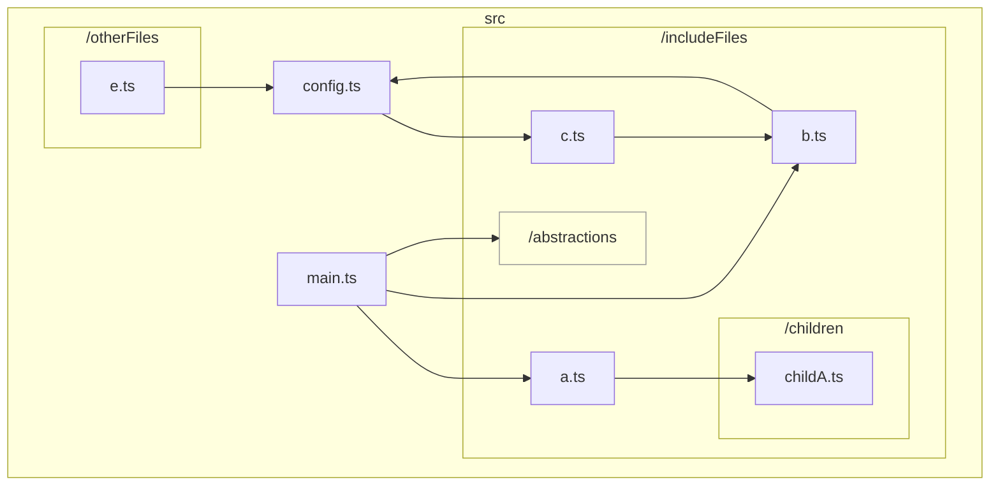
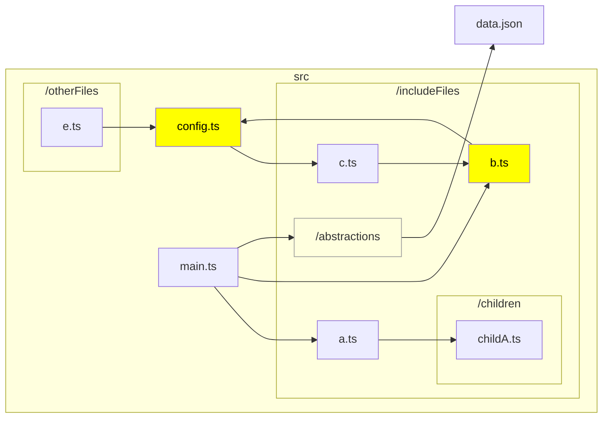

# TypeScript graph

<p align="center">
  <a href="/docs/README_en.md">English</a> •
  <a href="/docs/README_ja.md">日本語 (Japanese)</a> 
</p>

TypeScript のコードベースにおけるファイル間の依存関係を可視化するための CLI です。

例えば、https://github.com/ysk8hori/numberplace のベースディレクトリで以下のコマンドを実行すると、以下のような結果が得られます。

```bash
tsg src/components/atoms/ConfigMenu --exclude test stories node_modules
```



## Installation

```bash
npm install --global @ysk8hori/typescript-graph
```

## Arguments

| 引数            | 説明                                                                                                                        |
| --------------- | --------------------------------------------------------------------------------------------------------------------------- |
| `include-files` | グラフに含めるファイルパスやその一部を指定します（tsconfig ディレクトリからの相対パスで、`./`は不要です）。(デフォルト: "") |

## Options

| オプション                | 説明                                                                                                                                                                                                                                                                       |
| ------------------------- | -------------------------------------------------------------------------------------------------------------------------------------------------------------------------------------------------------------------------------------------------------------------------- |
| `-V, --version`           | バージョン番号を出力                                                                                                                                                                                                                                                       |
| `--md <char>`             | 出力するMarkdownファイルの名前を指定します。デフォルトは typescript-graph.md です。                                                                                                                                                                                        |
| `-d, --dir <char>`        | 解析対象のTypeScriptプロジェクトのルートディレクトリを指定します。そこにある tsconfig.json を読み取り、解析します。                                                                                                                                                        |
| `--tsconfig <char>`       | 解析に使用する tsconfig ファイルのパスを指定します。これが指定された場合、`-d, --dir` を無視します。                                                                                                                                                                       |
| `--include <char...>`     | グラフに含めるファイルパスやその一部を指定します（tsconfig ディレクトリからの相対パスで、`./`は不要です）。                                                                                                                                                                |
| `--exclude <char...>`     | グラフから除外するファイルパスやその一部を指定します（tsconfig ディレクトリからの相対パスで、`./`は不要です）。                                                                                                                                                            |
| `--abstraction <char...>` | 抽象化したいディレクトリのパスを指定します。抽象化したディレクトリは一つのノードとして扱います。                                                                                                                                                                           |
| `--highlight <char...>`   | 強調表示するパスとファイル名を指定します。                                                                                                                                                                                                                                 |
| `--LR`                    | フローチャートの向きを左から右に指定します。                                                                                                                                                                                                                               |
| `--TB`                    | フローチャートの向きを上から下に指定します。                                                                                                                                                                                                                               |
| `--measure-instability`   | モジュールの不安定性を測定するベータ機能を有効化します。                                                                                                                                                                                                                   |
| `--metrics`               | 保守性指数（Maintainability Index）、サイクロマティック複雑度（Cyclomatic Complexity）、認知的複雑度（Cognitive Complexity）などのコード・メトリクスを測定するベータ機能を有効化します。コード品質を定量的に評価するための分析ツールとして利用可能です。                   |
| `-w, --watch-metrics`     | ファイルの変更をリアルタイムで監視し、変更が発生するたびに Maintainability Index、Cyclomatic Complexity、Cognitive Complexity などのメトリクスを表示します。継続的な品質チェックに利用可能です。                                                                           |
| `--config-file`           | 設定ファイルへの相対パスを指定します（カレントディレクトリまたは -d, --dir で指定された場所から）。デフォルトは .tsgrc.json です。                                                                                                                                         |
| `--vue` (experimental)    | `.vue` ファイルも対象とします。Node.js の `fs.mkdtempSync` によって作業ディレクトリを作成し、そこへ tsc 対象となるファイルと `.vue` ファイルをコピーして解析します。`.vue` ファイルは `.vue.ts` へとリネームしますが、すでにそのファイルが存在する場合はリネームしません。 |
| `-h, --help`              | コマンドのヘルプを表示します。                                                                                                                                                                                                                                             |

## 使い方

解析したいプロジェクトで `tsg` を実行します。

```bash
tsg
```



👆 で、ファイルの依存関係を出力しています。

これではごちゃごちゃして分かりにくいです。
また、大規模なリポジトリの場合、マーメイドは表示可能なデータの最大量を超えてしまうことがあります。

その場合、グラフに含めるディレクトリを絞り込む必要があります。

### 引数または `--include` オプション

グラフに含めるディレクトリやファイルを絞り込むには、引数または `--include` オプションでパスまたはその一部を指定します。

```bash
tsg src/includeFiles config
```



👆 のように引数または `--include` で指定したディレクトリの依存関係のみを、出力するようになります。
ただし、ここで指定したディレクトリ配下のファイルの依存先は表示されたままになります。
もし、興味のないディレクトリやファイルがある場合は、 `--exclude` を使って除外してください。

#### フルパスを指定して除外対象外とする (experimental)

あるフォルダに対して `exclude` を使用して依存関係を無視することが必要な場合がありますが、そのフォルダ内にグラフに含めたい一部のファイルが存在するといった状況も存在します。
このような場合、特定のファイルについては引数または `--include` でそのファイルの完全パスを指定することで、そのファイルを除外リストから除くことができます。

### `--exclude`

グラフから除外するディレクトリやファイルは `--exclude` オプションで除外します。

```bash
tsg includeFiles config --exclude excludeFiles utils
```



`--exclude` で指定されたディレクトリは依存関係グラフから除外されました。

おっと、`src/includeFiles/b.ts` と `src/includeFiles/c.ts` と `src/config.ts` が循環参照になっていました。これをすぐにチームに報告してリファクタリングしましょう。しかし、`src/includeFiles/abstractions` はこの問題とは関係ないので、できれば詳細を見せたくないのです。`src/includeFiles/abstractions` の詳細は、 `--abstraction` で隠すことができます。

### `--abstraction`

ディレクトリ内のファイルには興味がなくても、そのディレクトリへの依存関係はグラフに残しておきたい場合があります。
そのような場合は、 `--abstraction` を使用して、ディレクトリを抽象化します。

```bash
tsg includeFiles config --exclude excludeFiles utils --abstraction abstractions
```



これで、チームと問題の共有がしやすくなりました 👍

でも、注目してほしい箇所を強調したいですね 🤔

### `--highlight`

注意が必要なノードを強調表示するには、`--highlight` を使用します。

```bash
tsg includeFiles config --exclude excludeFiles utils --abstraction abstractions --highlight config.ts b.ts --LR
```



さらにチームと問題の共有がしやすくなりました 👍

## コードメトリクスの測定

保守性指数（Maintainability Index）、サイクロマティック複雑度（Cyclomatic Complexity）、認知的複雑度（Cognitive Complexity）などのコード・メトリクスを測定するベータ機能です。これらのメトリクスは一般的に知られていますが、TypeScript に当てはめた場合には信頼性が高いものではありません。それでも、コードの品質について考える際の指標にはなりうると考えています。

例えば、 `typescript-graph/dummy_project_for_metrics` に移動し以下のコマンドを実行します。

```bash
tsg --metrics
```

通常の `typescript-graph.md` の内容に加えて、以下のようなメトリクスが出力されます。

---

<table>
<thead><tr><th scope="col">file</th><th scope="col">scope</th><th scope="col">name</th><th scope="col">Maintainability Index</th><th scope="col">Cyclomatic Complexity</th><th scope="col">Cognitive Complexity</th><th scope="col">lines</th><th scope="col">semantic syntax volume</th><th scope="col">total operands</th><th scope="col">unique operands</th><th scope="col">total semantic syntax</th><th scope="col">unique semantic syntax</th></tr></thead>
<tbody>
<tr><th scope="row">badCode.ts</th><th scope="row">file</th><th scope="row">-</th><td> 28.54</td><td> 27</td><td> 351</td><td> 111</td><td> 1807.98</td><td> 107</td><td> 55</td><td> 190</td><td> 13</td></tr>
<tr><th scope="row">badCode.ts</th><th scope="row">function</th><th scope="row">badCode</th><td>💥 7.23</td><td> 27</td><td> 351</td><td> 110</td><td> 1814.06</td><td> 107</td><td> 55</td><td> 191</td><td> 13</td></tr>
<tr><th scope="row">goodCode.ts</th><th scope="row">file</th><th scope="row">-</th><td> 82.21</td><td> 2</td><td> 1</td><td> 4</td><td> 77.66</td><td> 6</td><td> 4</td><td> 13</td><td> 13</td></tr>
<tr><th scope="row">goodCode.ts</th><th scope="row">function</th><th scope="row">goodCode</th><td> 76</td><td> 2</td><td> 1</td><td> 3</td><td> 81.75</td><td> 6</td><td> 4</td><td> 14</td><td> 13</td></tr>
</tbody></table>
<details>
<summary>CSV</summary>

```csv
file,scope,name,Maintainability Index,Cyclomatic Complexity,Cognitive Complexity,lines,semantic syntax volume,total operands,unique operands,total semantic syntax,unique semantic syntax
badCode.ts,file,-,28.540438644839494,27,351,111,1807.9764638513507,107,55,190,13
badCode.ts,function,badCode,7.2309524830767815,27,351,110,1814.063926692601,107,55,191,13
goodCode.ts,file,-,82.20502409726409,2,1,4,77.66179398375644,6,4,13,13
goodCode.ts,function,goodCode,75.99910291534641,2,1,3,81.74925682500678,6,4,14,13
```

</details>

<details>
<summary>TSV</summary>

```tsv
file	scope	name	Maintainability Index	Cyclomatic Complexity	Cognitive Complexity	lines	semantic syntax volume	total operands	unique operands	total semantic syntax	unique semantic syntax
badCode.ts	file	-	28.540438644839494	27	351	111	1807.9764638513507	107	55	190	13
badCode.ts	function	badCode	7.2309524830767815	27	351	110	1814.063926692601	107	55	191	13
goodCode.ts	file	-	82.20502409726409	2	1	4	77.66179398375644	6	4	13	13
goodCode.ts	function	goodCode	75.99910291534641	2	1	3	81.74925682500678	6	4	14	13
```

</details>

---

### 保守性指数（Maintainability Index）

コードの保守の相対的な容易さを表す 0 から 100 の範囲の指数値を計算します。 値が大きいほど、保守容易性が向上します。2段階のしきい値を持っており、しきい値を下回る場合にアイコンを表示します。
メトリクス機能はベータ版であり、計測式及びしきい値は変動することがあります。

| threshold | state    | icon |
| --------- | -------- | ---- |
| 20        | alert    | 🧨   |
| 10        | critical | 💥   |

今後のアップデートでは、計算式やしきい値のカスタマイズを可能にすることを考えています。

### サイクロマティック複雑度（Cyclomatic Complexity）

TypeScript Graph におけるサイクロマティック複雑度は、 Conditional Types も含みます。それ以外の情報はここで読むよりググったほうがより正確でしょう。

### 認知的複雑度（Cognitive Complexity）

雑に説明すると、サイクロマティック複雑度と同様に制御フローの分岐に基づいたスコアですが、認知的複雑度ではネストした制御構文に対してペナルティが設けられます。

[SonarSource](https://www.sonarsource.com)社のG. Ann Campbell氏によるホワイトペーパー「[A new way of measuring understandability](https://www.sonarsource.com/docs/CognitiveComplexity.pdf)」を元にして実装しています。なお、このプロジェクトは SonarSource 社と提携はしていません。

現状の実装では、TypeScript の型に対する考慮は十分ではありません。何らかの考慮が必要だと考えています。今後のアップデートで改善するかもしれません。

#### SonarSource 社の Cognitive Complexity との差異

Class の代わりに用いられる宣言的な function におけるオブジェクトへの関数の代入についての扱いが異なります。SonarSource 社のものは「宣言的であるかどうか」を判定し宣言的でない場合のみネストレベルをインクリメントしますが、TypeScript Graph においては宣言的かどうかの判定をせずネストレベルをインクリメントします。

### Semantic Syntax Volume

Maintainability Index の計算において、一般的には Halstead Volume という値を使用します。これはソースコード中の、演算子の総数及びユニークな数、オペランドの総数及びユニークな数を用いて測定します。

TypeScript Graph においては、（AST から演算子の数を数えるのが面倒だったので）AST におけるオペランド以外のノードの数を使用しています（実際にはそこからさらにカウントする意味がないと思われるものを差し引きます）。

計算式は以下になります。

```typescript
function volume(): number {
  const N = totalSemanticSyntax.count + totalOperands.count;
  const n = uniqueSemanticSyntax.count + uniqueOperands.count;
  return N * Math.log2(n);
}
```

### コードメトリクスの監視

以下のコマンドで、ファイルの変更をリアルタイムで監視し、変更が発生するたびに Maintainability Index、Cyclomatic Complexity、Cognitive Complexity などのメトリクスを表示します。

```bash
tsg --watch-metrics
```


`()` 内の値は、監視開始時からの差分です。より良い値へと変わった場合は緑で、より悪い値へ変わった場合は赤で表示します。値の増減の良し悪しはメトリクスによって異なります。以下に対応表を記載します。

| Metrics name          | Better direction |
| --------------------- | ---------------- |
| Maintainability Index | higher           |
| Cyclomatic Complexity | lower            |
| Cognitive Complexity  | lower            |
