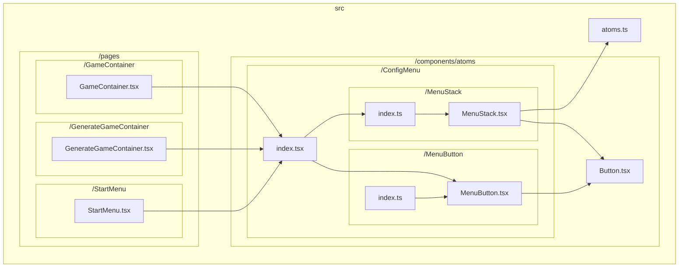
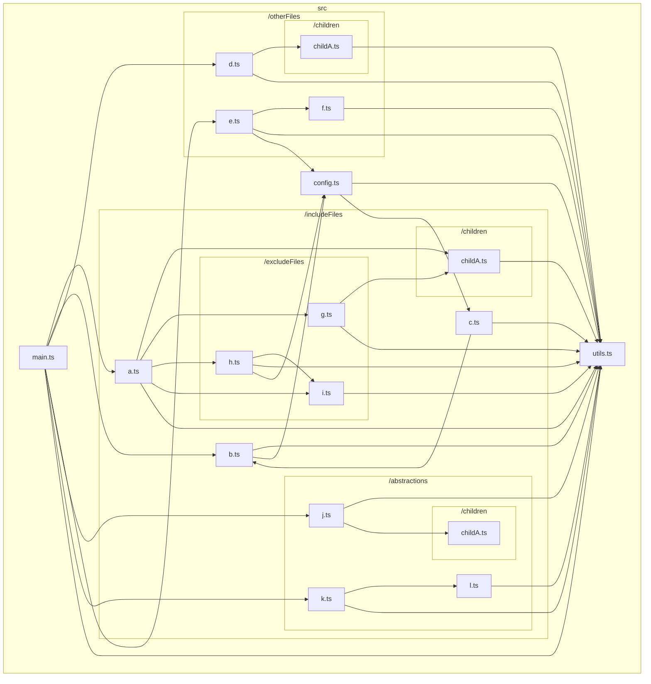
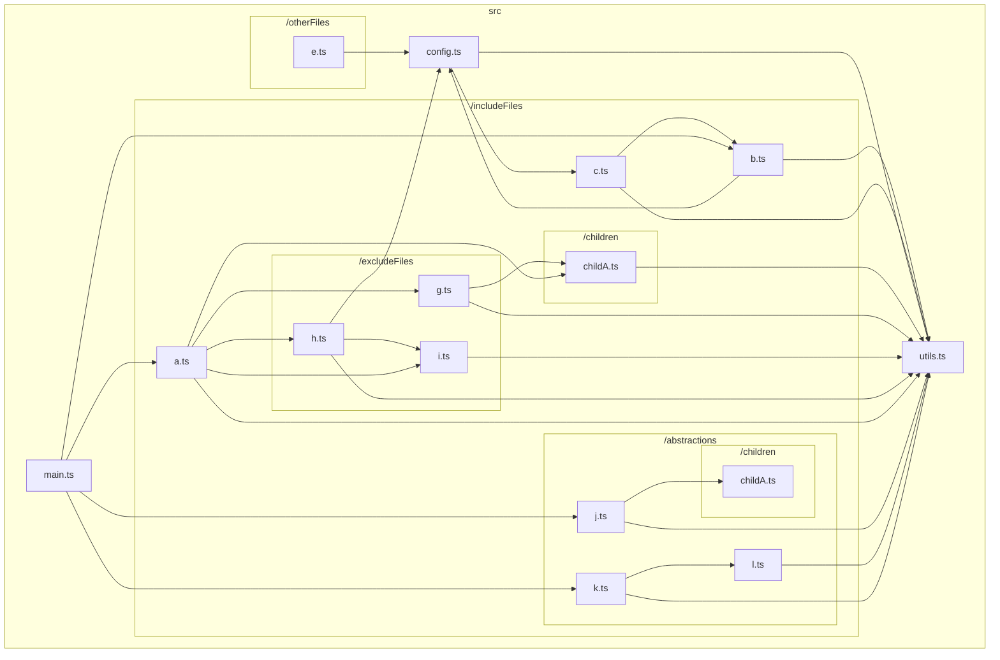
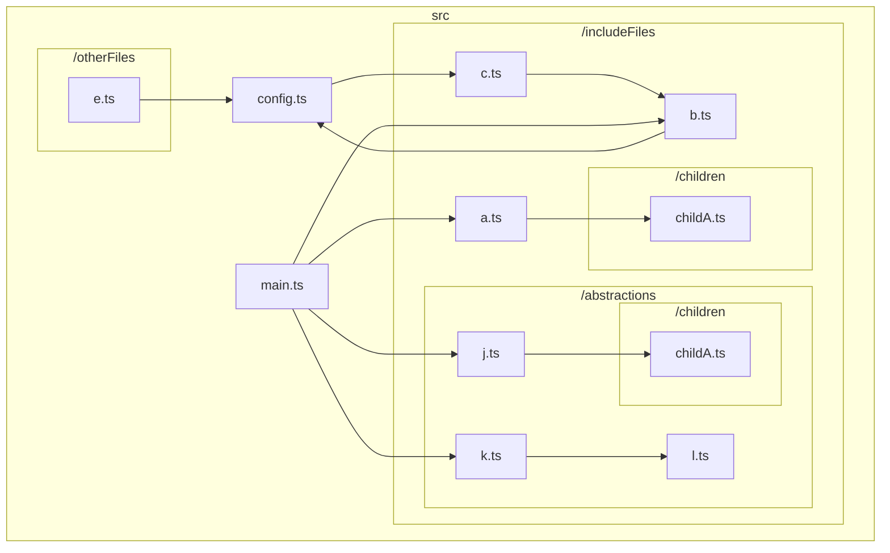
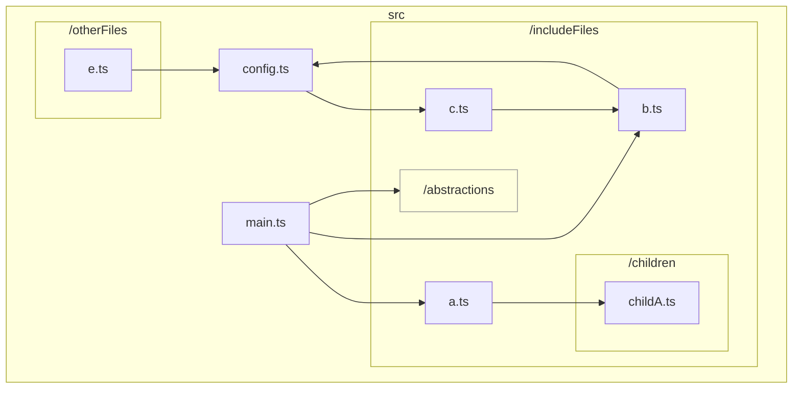

# TypeScript graph

<p align="center">
  <a href="/docs/README_en.md">English</a> •
  <a href="/docs/README_ja.md">日本語 (Japanese)</a> 
</p>

TypeScript のコードベースにおけるファイル間の依存関係を可視化するための CLI です。

例えば、https://github.com/ysk8hori/numberplace のベースディレクトリで以下のコマンドを実行すると、以下のような結果が得られます。

```bash
tsg --include src/components/atoms/ConfigMenu --exclude test stories node_modules
```



## Installation

```bash
npm install --save-dev @ysk8hori/typescript-graph
```

または global install をしてください。

## Options

`tsg -h` でヘルプを表示します。

```Options:
  -V, --version            output the version number
  --md <char>              Specify the name of the markdown file to be output. Default is typescript-graph.md.
  --mermaid-link           Generates a link on node to open that file in VSCode.
  -d, --dir <char>         Specify the TypeScript code base to be analyzed. if tsconfig.json is not found, specify the directory where tsconfig.json is located.
  --include <char...>      Specify paths and file names to be included in the graph
  --exclude <char...>      Specify the paths and file names to be excluded from the graph
  --abstraction <char...>  Specify the path to abstract
  --LR                     Specify Flowchart orientation Left-to-Right
  --TB                     Specify Flowchart orientation Top-to-Bottom
  --neo4j                  output to neo4j on localhost:7687
  --clear-db               clear neo4j database before output
  -h, --help               display help for command
```

## 使い方

解析したいプロジェクトで `tsg` を実行します。

```bash
tsg
```



👆 で、ファイルの依存関係を出力しています。

これではごちゃごちゃして分かりにくいです。
また、大規模なリポジトリの場合、マーメイドは表示可能なデータの最大量を超えてしまうことがあります。

その場合、グラフに含めるディレクトリを絞り込む必要があります。

### `--include`

グラフに含めるディレクトリやファイルを絞り込むには、 `--include` オプションを使用します。

```bash
tsg --include includeFiles config
```



👆 のように `--include` で指定されたディレクトリの依存関係のみが、出力されるようになります。
ただし、 `--include` で指定したディレクトリ配下のファイルの依存先は表示されたままになります。
もし、興味のないディレクトリやファイルがある場合は、 `--exclude` を使って除外してください。

### `--exclude`

グラフから除外するディレクトリやファイルは `--exclude` オプションで除外します。

```bash
tsg --include includeFiles config --exclude excludeFiles utils
```



`--exclude` で指定されたディレクトリは依存関係グラフから除外されました。

おっと、`src/includeFiles/b.ts` と `src/includeFiles/c.ts` と `src/config.ts` が循環参照になっていました。これをすぐにチームに報告してリファクタリングしましょう。しかし、`src/includeFiles/abstractions` はこの問題とは関係ないので、できれば詳細を見せたくないのです。`src/includeFiles/abstractions` の詳細は、 `--abstraction` で隠すことができます。

### `--abstraction`

ディレクトリ内のファイルには興味がなくても、そのディレクトリへの依存関係はグラフに残しておきたい場合があります。
そのような場合は、 `--abstraction` を使用して、ディレクトリを抽象化します。

```bash
tsg --include includeFiles config --exclude excludeFiles utils --abstraction abstractions
```



これで、チームと問題の共有がしやすくなりました 👍

## その他のオプション

### --mermaid-link

VSCode で開くために、Mermaid ノードにリンクを追加します。Mermaid は以下のようにクリックイベントを出力します。

```
    click src/createGraph.ts href "vscode://file//your/path/typescript-graph/src/createGraph.ts" _blank
```

しかし、これは動作しません。クリックイベントの定義は正しいし、URL も正しいのですが、VSCode のマーメイドプレビューでは動作しないのです。これは、いつか動作することを期待して実装した機能です 🤣
